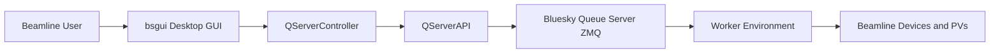

# Beamline GUI and Queue Monitoring Toolkit

`bsgui` is a PySide6 desktop application for microscopy data inspection, Bluesky
Queue Server control, and beamline monitoring. The repository also includes a
Slack bot for remote queue visibility.

The GUI is assembled from reusable widgets and YAML configuration files, so the
same application shell can be reused across multiple beamlines with different
tabs and options.

See the user guide in [docs/user-guide.md](./docs/user-guide.md) for a
task-oriented walkthrough with diagrams.

For the workflow shown in the screenshots below, start the BNP-oriented layout:

```bash
python main.py --config bsgui/config/bnp_widgets.yaml
```

## Screenshots

### `scan_setup`


BNP usage: load an XRF map, select an ROI or point on the shared canvas, then
use the plan editor and optional `sync XYZ` / `sync XYZ + transform` actions to
prepare queue inputs.

### `qserver_monitor`


BNP usage: inspect pending items, confirm the active plan state, and use queue
or RunEngine controls from the same tab.

### `beamline_monitor`


BNP usage: watch the enriched hardware snapshot from QServer, confirm current
activity, and follow detector recovery progress in the timestamped status area.

## What It Provides

- `scan_setup`: load XRF and ptychography data, view it on a shared canvas, and
  prepare plan inputs from ROIs or selected points
- `qserver_monitor`: inspect queue state, active plan progress, and queue
  history, and issue queue or RunEngine actions
- `beamline_monitor`: show a plan-aware hardware snapshot, activity summary,
  device health, and detector recovery status
- `scan_parameter_viewer`: browse Bluesky HDF5 files and inspect extracted scan
  metadata
- `bs_slack_bot`: post queue and console status to Slack

## Repository Layout

```text
bsgui/
  config/        YAML app and tab configuration
  core/          QServer API/controller and shared logic
  ui/            PySide6 widgets
bs_slack_bot/    Slack bot runtime
docs/            User-facing documentation
main.py          Desktop GUI entry point
requirements.txt Python dependencies
```

## Installation

```bash
python3 -m venv .venv
source .venv/bin/activate
pip install -r requirements.txt
pip install PyYAML
```

## Running the GUI

Launch the default tab set:

```bash
python main.py
```

Launch a specific set of tabs:

```bash
python main.py scan_setup qserver_monitor
python main.py scan_setup qserver_monitor beamline_monitor
```

Use a beamline-specific configuration:

```bash
python main.py --beamline bnp
python main.py --beamline s2idd
python main.py --beamline s2ide
python main.py --beamline isn
```

Use an explicit config file:

```bash
python main.py --config bsgui/config/widgets.yaml
python main.py --config bsgui/config/bnp_widgets.yaml
```

Add extra data search paths:

```bash
python main.py --data-path /path/to/xrf --data-path /path/to/ptycho
```

## Queue Server Setup

Live queue and monitor features require Queue Server addresses:

```bash
export QSERVER_ZMQ_CONTROL_ADDRESS=tcp://host:port
export QSERVER_ZMQ_INFO_ADDRESS=tcp://host:port
```

If those variables are not set, the application also looks for a local `.env`
file.

## Configuration

Application behavior is driven by YAML files in [bsgui/config](./bsgui/config).
Common settings include:

- app title and window size
- enabled tabs
- loader search paths and file patterns
- plan-editor ROI key mapping and sync buttons
- queue monitor polling interval and table columns
- beamline monitor polling and detector recovery options
- scan-setup grid layout

Useful examples:

- [bsgui/config/widgets.yaml](./bsgui/config/widgets.yaml)
- [bsgui/config/bnp_widgets.yaml](./bsgui/config/bnp_widgets.yaml)
- [bsgui/config/s2idd_widgets.yaml](./bsgui/config/s2idd_widgets.yaml)
- [bsgui/config/s2ide_widgets.yaml](./bsgui/config/s2ide_widgets.yaml)
- [bsgui/config/isn_widgets.yaml](./bsgui/config/isn_widgets.yaml)

## GUI Architecture



## Primary Widgets

### `scan_setup`

Combines:

- XRF loader
- ptychography loader
- shared Matplotlib canvas
- plan editor
- queue status summary
- console output panel

In the BNP config, the plan editor also exposes scan-specific ROI key mapping,
sample-theta batch support, and coordinate sync actions backed by QServer
helper functions.


### `qserver_monitor`

Provides:

- start, stop, pause, resume, abort, and clear queue actions
- pending queue table
- running plan progress view
- completed history export


### `beamline_monitor`

Provides:

- current activity summary
- manifest path and snapshot timestamp
- per-device status rows
- detector auto-recovery trigger path
- timestamped recovery progress log in the widget

In the BNP config, this tab is designed to consume the QServer-enriched monitor
snapshot rather than hardcoded GUI health logic.


## Running the Slack Bot

Required environment:

```bash
export SLACK_BOT_TOKEN=xoxb-...
export SLACK_APP_TOKEN=xapp-...
export QSERVER_ZMQ_CONTROL_ADDRESS=tcp://host:port
export QSERVER_ZMQ_INFO_ADDRESS=tcp://host:port
```

Optional environment:

```bash
export SLACK_ALERT_CHANNEL=C12345678
export SLACK_CONSOLE_STALL_SECONDS=1800
export SLACK_CONSOLE_WATCHDOG_POLL_SECONDS=15
```

Start the bot:

```bash
python bs_slack_bot/slackbot.py
```

## Reuse as a Library

Reusable exports are available from:

- [bsgui/ui/__init__.py](./bsgui/ui/__init__.py)
- [bsgui/core/__init__.py](./bsgui/core/__init__.py)
- [bsgui/widgets.py](./bsgui/widgets.py)

## Security

Do not commit Slack tokens, Queue Server addresses tied to restricted networks,
or other beamline secrets. Keep them in environment variables or an untracked
local `.env`.
