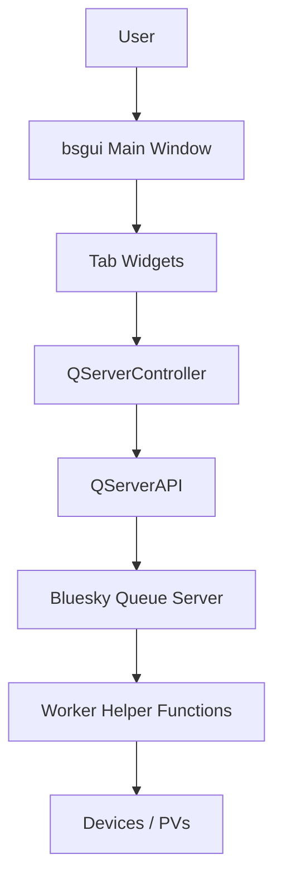
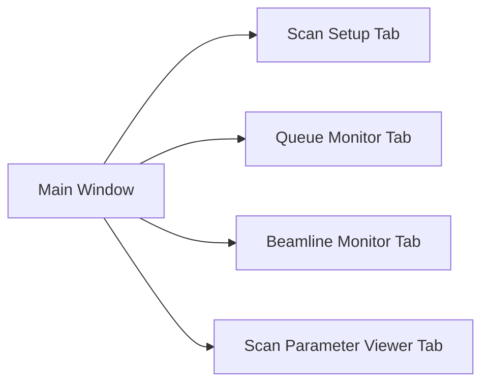
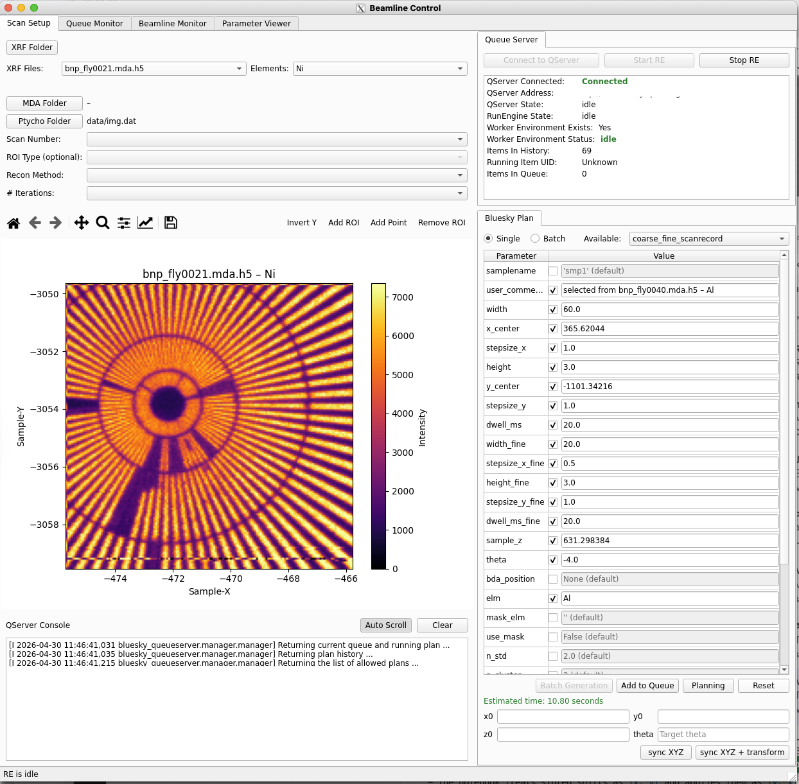
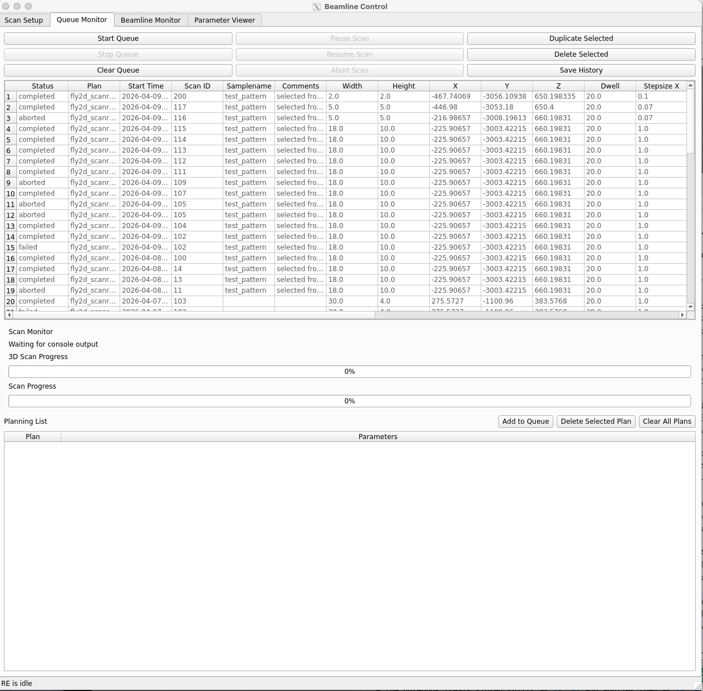
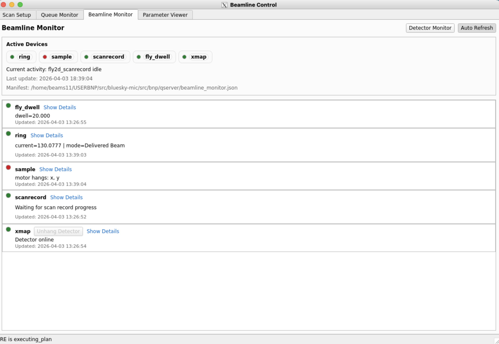
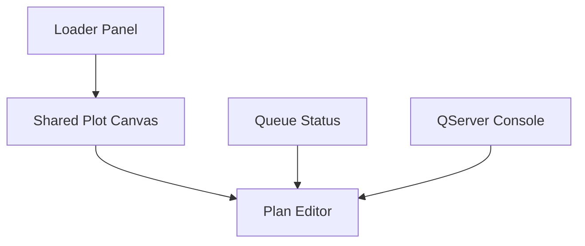
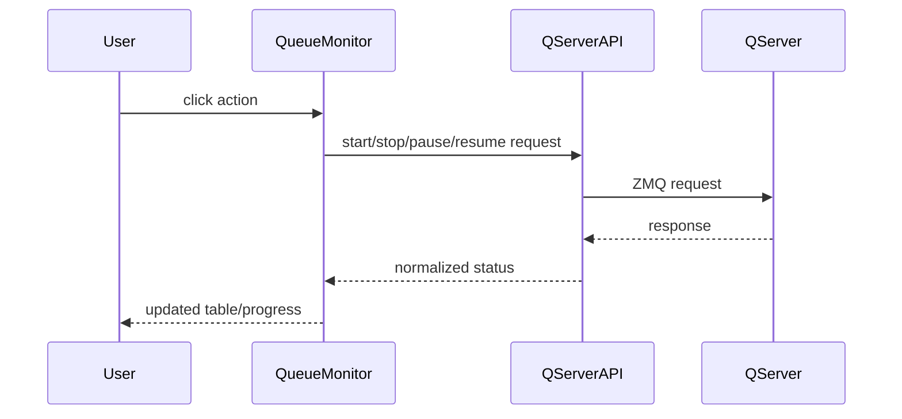
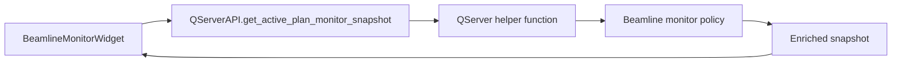
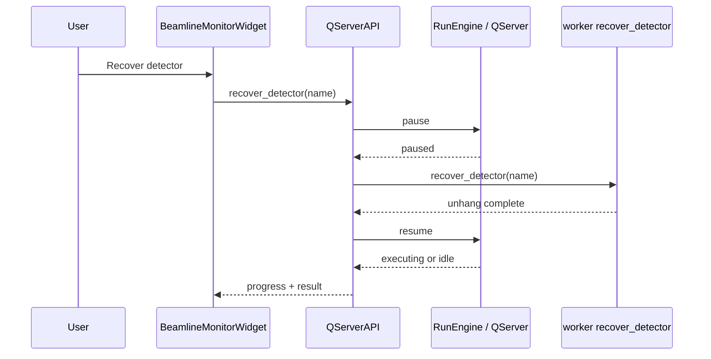

# bsgui User Guide

This guide is written as a lightweight in-repo wiki for users who need to run
the GUI, understand its tabs, and know how data and queue state move through
the application.

## 1. What the GUI Is For

`bsgui` is a user-facing control and monitoring layer that bridges Bluesky
RunEngine execution, Queue Server operations, and operator interaction at the
beamline.

In practice, the GUI sits between the user and the Bluesky runtime stack:

- users inspect data, prepare scans, submit actions, and monitor progress
- Queue Server manages queued plans and operational control requests
- RunEngine and worker-side helpers execute scans and interact with devices

The GUI also provides a basic level of beamline and scan monitoring so users
can see queue state, active scan progress, device health summaries, and
detector recovery status from one application.

`bsgui` combines several practical workflows:

- load and inspect beamline data products
- prepare or submit Bluesky queue plans
- bridge queue and RunEngine actions into a usable operator interface
- watch the Queue Server, scan state, and beamline state while scans are running

At runtime, the exact tab set depends on the YAML config you start with. The
default config focuses on `scan_setup` and `qserver_monitor`. The BNP config
adds `beamline_monitor` and `scan_parameter_viewer`.

## 2. Runtime Architecture



The important boundary is:

- `bsgui` renders state and sends user actions
- QServer and worker-side helpers own queue execution and beamline-specific
  monitor logic

## 3. Starting the GUI

Default app:

```bash
python main.py
```

BNP-oriented app:

```bash
python main.py --config bsgui/config/bnp_widgets.yaml
```

Beamline alias if a matching config file exists:

```bash
python main.py --beamline bnp
```

Queue Server variables must be defined for live control and monitoring:

```bash
export QSERVER_ZMQ_CONTROL_ADDRESS=tcp://host:port
export QSERVER_ZMQ_INFO_ADDRESS=tcp://host:port
```

For the BNP workflow shown in the screenshots in this guide, the expected
startup command is:

```bash
python main.py --config bsgui/config/bnp_widgets.yaml
```

## 4. Main Window Layout

The main window is a `QTabWidget`. Each tab is registered from code and then
instantiated from config.



The tabs you actually see depend on the config file.

## Rendered GUI Windows At A Glance

### Scan Setup



This screenshot shows the BNP layout where data loading, plan preparation, and
queue status are visible in one workspace.

### Queue Monitor



This screenshot shows the operational queue view used after plans have been
prepared and submitted.

### Beamline Monitor



This screenshot shows the BNP monitor consuming the QServer hardware snapshot
and exposing detector recovery feedback.

## 5. Scan Setup Tab

The `scan_setup` tab is the workspace for looking at data and translating a
selection into queue-ready plan parameters.

### Typical layout



### What users do here

1. Load an XRF or ptychography dataset.
2. Inspect the plotted image.
3. Draw an ROI or pick a point on the canvas.
4. Let the plan editor map those values into plan parameters.
5. Push the plan to Queue Server.

For BNP specifically, a common path is:

1. Load the XRF file and inspect the fluorescence map.
2. Select the intended scan region on the shared canvas.
3. Confirm mapped fields such as `x`, `y`, `z`, `stepsize_x`, `stepsize_y`,
   `dwell`, and `theta`.
4. Use `sync XYZ` or `sync XYZ + transform` if the current stage position or
   theta transform must be applied before queue submission.
5. Submit the resulting plan to QServer.

### Key pieces

- XRF loader for file browsing and beamline data loading
- ptychography loader for scan-number-driven selection
- shared Matplotlib canvas for plotting and ROI work
- plan editor for plan kind selection and argument editing
- queue status panel for quick server state visibility
- console output panel for live QServer messages

BNP-specific plan-editor behavior from `bnp_widgets.yaml` includes:

- ROI key mapping for `samplename`, `x`, `y`, `z`, `dwell`, `stepsize_x`,
  `stepsize_y`, and `theta`
- `single` and `batch` plan modes
- theta batch iteration support
- QServer-backed `sync XYZ` and `sync XYZ + transform` actions


## 6. Queue Monitor Tab

The `qserver_monitor` tab is the operational queue view.

### Responsibilities

- inspect pending queue items
- view the currently running plan
- pause, resume, or abort a running scan
- clear or reorder pending entries
- duplicate or delete selected queue rows
- export completed history

### Operational model



This tab is where queue control happens. The beamline monitor is primarily a
status and recovery view.

In a BNP session, this tab usually follows `scan_setup`: once a plan is built,
this is where you confirm that it entered the queue correctly and watch
execution progress.


## 7. Beamline Monitor Tab

The `beamline_monitor` tab is intended for plan-aware hardware status.

### What it shows

- current activity text
- snapshot timestamp
- monitor manifest path
- device overview chips
- per-device status rows
- detector recovery controls when a detector advertises recovery support
- a timestamped recovery status box

In BNP, the intent is that device summaries, health states, and recovery
actions are provided by QServer snapshot enrichment, with the GUI acting mainly
as a renderer.

### Snapshot flow



The monitor is intentionally moving toward a simpler contract:

- worker side computes `activity`, `summary`, `health`, and `actions`
- GUI side renders those fields with only minimal fallbacks

### Detector recovery flow



The recovery status box in the widget is the user-visible log for this sequence.

In practice, the BNP operator should use this tab to answer three questions:

1. What is the active scan doing right now?
2. Which device is unhealthy or waiting?
3. If detector recovery starts, which step is it on: pause, reset, or resume?


## 8. Scan Parameter Viewer Tab

This tab is only present in configurations that enable it. Its purpose is
different from `scan_setup`.

- `scan_setup` is for interactive planning from plotted data
- `scan_parameter_viewer` is for browsing existing Bluesky files and inspecting
  extracted scan metadata

Use it when you need to confirm what arguments were used in prior scans.

## 9. Configuration Model

The GUI is assembled from YAML, not from hardcoded tab lists in `main.py`.

Useful config files:

- `bsgui/config/widgets.yaml`: default app
- `bsgui/config/bnp_widgets.yaml`: BNP-focused app including beamline monitor
- `bsgui/config/s2idd_widgets.yaml`: S2IDD example
- `bsgui/config/s2ide_widgets.yaml`: S2IDE example
- `bsgui/config/isn_widgets.yaml`: ISN example

### What can be configured

- which tabs are enabled
- loader search paths and file patterns
- plan editor kinds and ROI mappings
- queue monitor polling interval and columns
- beamline monitor polling and detector recovery options
- scan-setup grid placement

## 10. Status and Error Reporting

There are two user-facing status paths:

- the application status bar for short operational messages
- in-widget labels for richer state, especially in the beamline monitor

If Queue Server connectivity is missing, many tabs still construct, but live
actions and live polling will not work.
